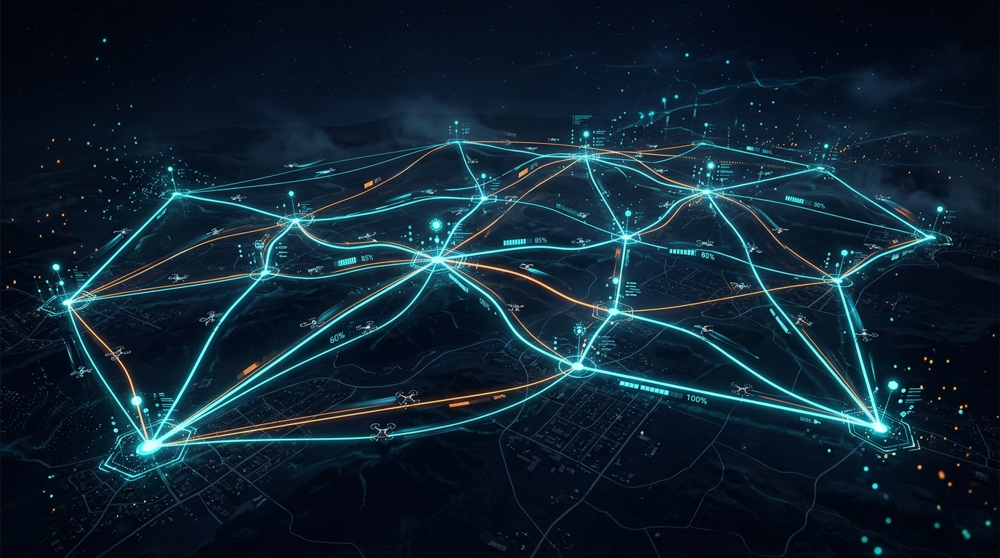
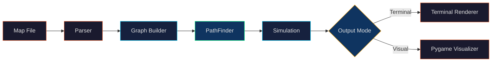

<p align="center">
  
</p>

<h1 align="center">Fly-In</h1>

<p align="center">
  <b>Autonomous multi-drone routing through capacity-constrained networks</b>
</p>

<p align="center">
  
  
  
  
</p>

---

## The Problem

Given a network of **hubs** connected by **links** with finite capacities, route **N drones** from a start hub to an end hub in the **minimum number of turns** — while respecting:

- **Node capacity** — each hub has a `max_drones` limit per turn
- **Edge capacity** — each link has a `max_link_capacity` per turn
- **Zone costs** — `normal` (1 turn), `restricted` (2 turns), `priority` (1 turn), `blocked` (impassable)
- **Collision avoidance** — no two drones can occupy the same constrained resource simultaneously

This is a variant of the **multi-agent pathfinding (MAPF)** problem with capacity constraints.

---

## Architecture



| Module | Responsibility |
|---|---|
| [`parsers.py`](parsers.py) | Parses the map file into zone/connection config objects |
| [`graph.py`](graph.py) | Builds an adjacency structure with capacity and cost metadata |
| [`pathfinder.py`](pathfinder.py) | Time-Expanded Dijkstra with shared reservation tables |
| [`simulation.py`](simulation.py) | Converts planned paths into turn-by-turn execution |
| [`renderer.py`](renderer.py) | Terminal output formatter |
| [`visualizer.py`](visualizer.py) | Real-time Pygame visualization with smooth interpolation |

---

## Algorithm: Time-Expanded Dijkstra

The core routing engine uses a **time-expanded graph** approach:

### Key Ideas

1. **State = (zone, turn)** — each node in the search space is a zone at a specific timestep
2. **Shared reservation tables** — after each drone is routed, its path is committed to:
   - `zone_reservations[(zone, turn)]` → tracks how many drones occupy a zone at each turn
   - `edge_reservations[(edge, turn)]` → tracks how many drones traverse a link at each turn
3. **Sequential planning** — drones are routed one at a time; later drones automatically detour or wait to avoid conflicts
4. **Wait action** — a drone can stay at its current zone for 1 turn (modeled as a self-edge with cost 1)

### Why this works

- **Optimal per-drone**: Dijkstra guarantees the shortest path for each drone given existing reservations
- **Collision-free by construction**: Capacity checks happen at search time, not as a post-processing step
- **Handles heterogeneous costs**: Restricted zones (cost 2) and blocked zones are natively supported

---

## Getting Started

### Prerequisites
- Python 3.12+
- Pygame 2.0+

### Installation

```bash
git clone https://github.com/DaftTake/fly-in.git
cd fly-in

make install
```

### Usage

```bash
# Terminal output
python3 main.py <path_to_map_file>

# Pygame visual simulation
python3 main.py --vis <path_to_map_file>
```

---

## Map File Format

```text
nb_drones: 2

start_hub: start 0 0 [color=green]
hub: waypoint1 1 0 [color=blue]
hub: waypoint2 2 0 [color=blue]
end_hub: goal 3 0 [color=red]

connection: start-waypoint1
connection: waypoint1-waypoint2
connection: waypoint2-goal
```

### Expected Output

```text
D1-waypoint1
D1-waypoint2 D2-waypoint1
D1-goal D2-waypoint2
D2-goal
```

> Each line is one simulation turn. Drones move simultaneously when capacity allows.

---

---

## Visualizers

The project features **two complementary visualizers**: an interactive **Web/JavaScript Algorithm Visualizer** for inspecting the graph search step-by-step, and a **Pygame 2D Simulation** for real-time drone flight playback.

---

### 1. Interactive JavaScript Algorithm Visualizer (`galles_visualizer/`)

Built on top of the Galles Canvas Animation Library, this web visualizer provides an educational, step-by-step trace of the **Time-Expanded Dijkstra Algorithm**:

<p align="center">
  
</p>

#### Key Features:
- **Real-Time Priority Queue (Frontier)**: Live visual of states `(Node, Turn)` waiting to be expanded.
- **Dynamic Dijkstra Table**: Tracks `State`, `Known`, `Cost`, and `Parent` for every node in the time-expanded graph.
- **Shared Reservation Tracking**: Live tables for `Zone Reservations` and `Edge Reservations` updating as each drone commits its path.
- **Multi-Drone Collision Avoidance Trace**: Watch Drone 1 find its shortest path, commit reservations, and Drone 2 dynamically detour or wait to avoid collisions.

#### How to Run:
You can run the web visualizer directly in any browser:

**Option A (Direct in Browser):**
- Simply double-click or open [`galles_visualizer/FlyIn.html`](galles_visualizer/FlyIn.html) in Chrome, Firefox, Safari, or Edge.

**Option B (Local Web Server):**
```bash
# Start a local web server from the project root
python3 -m http.server 8000

# Open in your browser
# http://localhost:8000/galles_visualizer/FlyIn.html
```

#### Controls:
- **Run Fly-In**: Start the automated pathfinding simulation for multiple drones.
- **Step / Step Back**: Step through the Dijkstra expansions one by one.
- **Animation Speed Slider**: Adjust playback speed in real-time.

---

### 2. Real-Time Pygame Drone Simulation

For realistic, continuous 2D flight playback of simulated turns:

<p align="center">
  
</p>

```bash
# Run simulation with Pygame visualizer
python3 main.py <path_to_map_file> --vis
```

#### Pygame Controls:
| Control | Action |
|---|---|
| `Space` | Play / Pause simulation |
| `→` | Step forward one turn |
| `←` | Step backward one turn |
| `↑` / `↓` | Adjust simulation speed |

#### Features:
- Dynamic topology rendering with zone colors, capacities, and link statuses
- Smooth drone movement interpolation between discrete turns
- Live drone ID tags and occupancy counters per hub

---

## Key Technical Challenges

| Challenge | Solution |
|---|---|
| **Multi-agent collision avoidance** | Shared reservation tables checked at search time |
| **Heterogeneous movement costs** | Time-expanded states naturally handle variable-cost edges |
| **Edge capacity constraints** | Reservation tracking across all turns of a multi-turn transit |
| **Scalability** | Upper bound on search depth: `nodes × drones × 2` turns |
| **Deadlock prevention** | Wait actions allow drones to yield and let earlier drones pass |

---

## Project Structure

```
fly-in/
├── main.py                # Entry point (CLI + visual mode)
├── parsers.py             # Map file parser with validation
├── models.py              # Zone & Connection data models
├── graph.py               # Graph builder with adjacency + costs
├── pathfinder.py          # Time-Expanded Dijkstra routing engine
├── simulation.py          # Turn-by-turn simulation runner
├── renderer.py            # Terminal output formatter
├── visualizer.py          # Pygame real-time visualizer
├── drone.png              # Drone sprite asset
├── galles_visualizer/     # HTML-based algorithm visualizer
├── assets/                # Project visuals
├── Makefile               # Build automation
├── requirements.txt       # Dependencies
└── .gitignore
```

---

## What I Learned

- **Time-expanded graphs** — modeling temporal constraints as spatial dimensions in the search graph
- **Multi-agent pathfinding** — how sequential planning with reservation tables provides a practical collision-free guarantee
- **Pygame real-time visualization** — building interactive simulations with smooth interpolation and playback controls
- **Graph algorithm design** — adapting Dijkstra for capacity-constrained, multi-cost networks

---

## Linting & Code Quality

```bash
make lint          # flake8 + mypy (standard)
make lint-strict   # mypy --strict
```

---

<p align="center">
  <sub>Built at <a href="https://1337.ma/">1337</a> (42 Network) 🇲🇦</sub>
</p>
